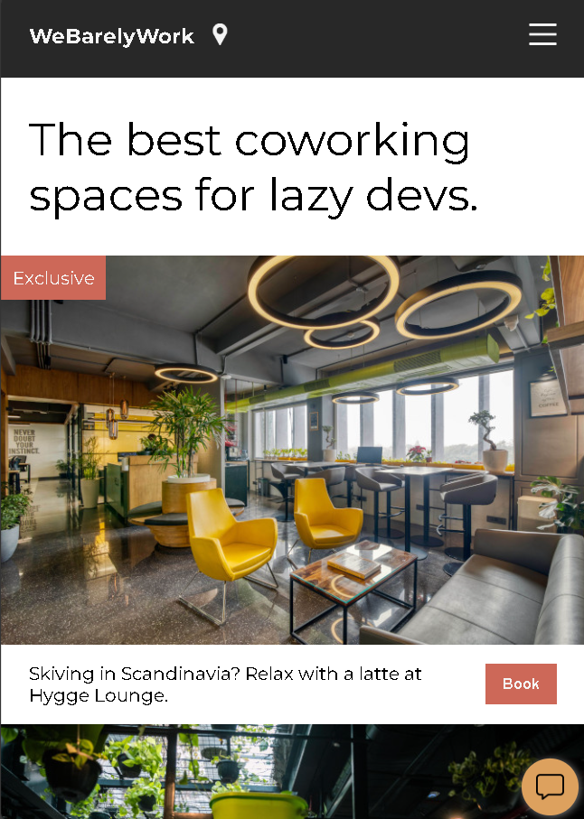
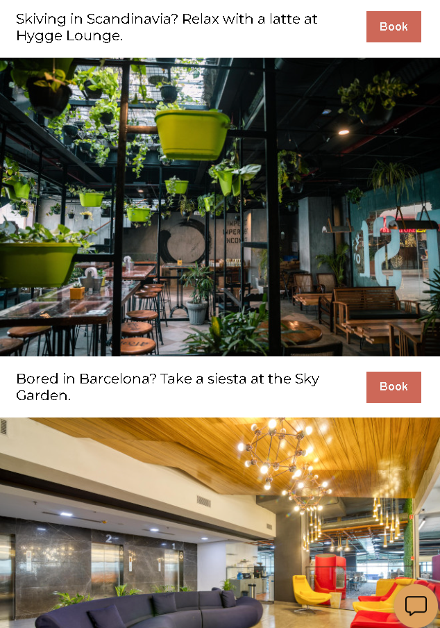
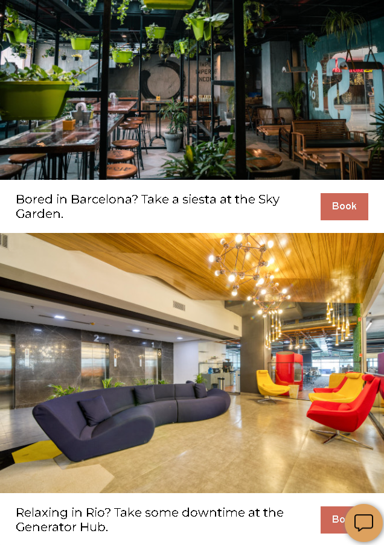

# 🚀 Coworking Space Site

A modern and responsive **coworking space landing page** built using **HTML & CSS**.
This project focuses on layout design, positioning, and clean UI structure.

---

## 🌐 Live Preview

*(Add your GitHub Pages link here if deployed)*

---

## 📸 Screenshots





---

## 📁 Project Structure

```
coworking-space-site/
│
├── index.html
├── style.css
├── images/
│   ├── burger.png
│   ├── generator.jpg
│   ├── hygge.jpg
│   ├── message.png
│   ├── pin.png
│   ├── sky-garden.jpg
│
├── Screenshots/
│   ├── Screenshot1.png
│   ├── Screenshot2.png
│   ├── Screenshot3.png
│
└── .gitattributes
```

---

## ✨ Features

* Clean and minimal UI design
* Flexbox-based layout
* Image cards with captions and CTA buttons
* Floating chat button with hover effect
* Banner tag ("Exclusive") using absolute positioning
* Fully responsive image handling

---

## 🧠 What I Learned

* Built structured layouts using **Flexbox**
* Used **positioning (relative & absolute)** for overlays like banners
* Designed clean **card-based UI components**
* Created interactive elements with **hover effects & transitions**
* Implemented a **floating fixed chat button**
* Improved **typography and visual hierarchy** using Google Fonts

---

## 🛠️ Tech Stack

* HTML5
* CSS3 (Flexbox, Positioning, Transitions)

---

## 🔗 Connect With Me

* 💼 LinkedIn: [https://www.linkedin.com/in/fakhar-e-alam-a046133b4/?skipRedirect=true](https://www.linkedin.com/in/fakhar-e-alam-a046133b4/?skipRedirect=true)
* 💻 GitHub: [https://github.com/ThisisAlam](https://github.com/ThisisAlam)

---

## 📚 Learning Resource

I’m currently learning Full Stack Web Development from Scrimba:

👉 [https://scrimba.com/?via=u43a7734](https://scrimba.com/?via=u43a7734)

---

## 🚧 Future Improvements

* Make it fully responsive for all devices
* Add animations for smoother interactions
* Convert into a dynamic web app using JavaScript
* Add booking functionality

---
